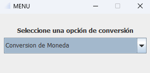
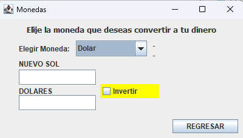
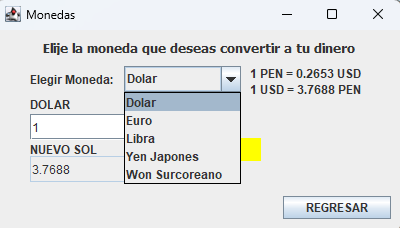
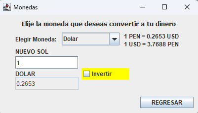
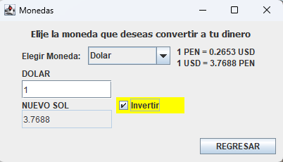

# Conversor de Monedas - Reto propuesto por Alura Laram

El objetivo de este programa creado con java 8.0 es y el IDE Eclipse es aplicar los conocimientos adquiridos hasta el momentos.

## Cómo usar el proyecto

1. Clona el repositorio en tu máquina local:

git clone https://github.com/elianpm/ConversorMonedas_Challenge_Oracle_One.git

2. Abre el proyecto usando IDE Eclipse for Java seleccionando la carpeta que acabas de clonar.

3. Iniciar la Aplicacion

## Interfaz Grafica del programa

- En el menú principal puedes elegir qué tipo de conversión deseas realizar.

- Luego de elegir el tipo de conversión se mostrará una nueva ventana donde puedes elegir sobre la lista la subcategoría de la conversión.

- Ahora solo queda ingresar el valor de conversión. La aplicación cuenta con un validador de números, esto implica que solo considerará para la conversión todo aquello que parezca un número. En el caso de la conversión de Monedas, considera solo los números positivos y el 0. Para el caso de la conversión de temperaturas considera números positivos y negativos.

## Contribuir al proyecto

Este proyecto es meramente con fines académicos y de práctica.

## Créditos

Este proyecto fue creado por Elian Paniagua.

## Licencia

Este proyecto está bajo la Licencia de GNU GENERAL PUBLIC LICENSE Version 3, 29 June 2007. Consulta el archivo [LICENSE](LICENSE) para obtener más información.

---

© 2023 Elian Paniagua. GNU GENERAL PUBLIC LICENSE Version 3. Consulta el archivo [LICENSE](LICENSE) para obtener más información.
